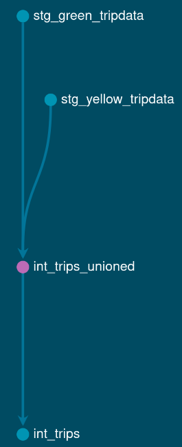

# Module 4: Analytics Engineering with dbt

In this homework, we'll use the dbt project in `04-analytics-engineering/taxi_rides_ny/` to transform NYC taxi data and answer questions by querying the models.

## Setup

1. The dbt project is set up following the [setup guide](https://github.com/DataTalksClub/data-engineering-zoomcamp/blob/main/04-analytics-engineering/setup)
2. Loaded the Green and Yellow taxi data for 2019-2020 into a duckdb database (as a warehouse)
3. Ran `dbt build --target prod` to create all models and run tests

After a successful build, we have models like `fct_trips`, `dim_zones`, and `fct_monthly_zone_revenue` in the warehouse:

```
models
├── intermediate
│   ├── int_trips.sql
│   ├── int_trips_unioned.sql
│   └── schema.yml
├── marts
│   ├── dim_vendors.sql
│   ├── dim_zones.sql
│   ├── fct_trips.sql
│   ├── schema.yml
│   └── reporting
│       ├── fct_monthly_zone_revenue.sql
│       └── schema.yml
└── staging
    ├── schema.yml
    ├── sources.yml
    ├── stg_green_tripdata.sql
    └── stg_yellow_tripdata.sql
```

---

### Question 1. dbt Lineage and Execution

Given a dbt project with the following structure:

```
models/
├── staging/
│   ├── stg_green_tripdata.sql
│   └── stg_yellow_tripdata.sql
└── intermediate/
    └── int_trips_unioned.sql (depends on stg_green_tripdata & stg_yellow_tripdata)
```

Here is the lineage graph:



If I run `dbt run --select int_trips_unioned`, what models will be built?

- ~`stg_green_tripdata`, `stg_yellow_tripdata`, and `int_trips_unioned` (upstream dependencies)~ → I should pass option `--select +int_trips_unioned`
- ~Any model with upstream and downstream dependencies to `int_trips_unioned`~ → I should pass option `--select +int_trips_unioned+`
- **`int_trips_unioned` only**
- ~`int_trips_unioned`, `int_trips`, and `fct_trips` (downstream dependencies)~ → `fct_trips` is not in the lineage graph.

Verification:
```bash
$ dbt run --target prod --select int_trips_unioned

Concurrency: 1 threads (target='prod')

1 of 1 START sql table model prod.int_trips_unioned ............................ [RUN]
1 of 1 OK created sql table model prod.int_trips_unioned ....................... [OK in 7.74s]

Finished running 1 table model in 0 hours 0 minutes and 7.83 seconds (7.83s).

Completed successfully

Done. PASS=1 WARN=0 ERROR=0 SKIP=0 NO-OP=0 TOTAL=1
```

---

### Question 2. dbt Tests

Added a generic test in `schema.yml`:

```yaml
columns:
  - name: payment_type
    data_tests:
      - accepted_values:
          arguments:
            values: [1, 2, 3, 4, 5]
            quote: false
```

The model `fct_trips` has been running successfully for months. A new value `6` now appears in the source data.

What happens when running `dbt test --select fct_trips`?

- dbt will **fail the test**, returning a non-zero exit code

---

### Question 3. Counting Records in `fct_monthly_zone_revenue`

After running your dbt project, query the `fct_monthly_zone_revenue` model.

```sql
select count(*)
from taxi_rides_ny.prod.fct_monthly_zone_revenue
;
```

What is the count of records in the `fct_monthly_zone_revenue` model?

- **12,184**

---

### Question 4. Best Performing Zone for Green Taxis (2020)

Using the `fct_monthly_zone_revenue` table, find the pickup zone with the **highest total revenue** (`revenue_monthly_total_amount`) for **Green** taxi trips in 2020.

```sql
select pickup_zone
  , sum(revenue_monthly_total_amount)
    as total_green_revenue_2020
from taxi_rides_ny.prod.fct_monthly_zone_revenue
where 
  service_type='Green'
  and year(revenue_month) = 2020
group by pickup_zone
order by total_green_revenue_2020 desc
limit 1
;
```

Which zone had the highest revenue?

- **East Harlem North** for a total of $1,817,339.75

---

### Question 5. Green Taxi Trip Counts (October 2019)

Using the `fct_monthly_zone_revenue` table, what is the **total number of trips** (`total_monthly_trips`) for Green taxis in October 2019?

```sql
select sum(total_monthly_trips) as total_trip
from taxi_rides_ny.prod.fct_monthly_zone_revenue
where service_type = 'Green'
  and revenue_month >= '2019-10-01'
  and revenue_month <  '2019-11-01'
;
```

- **384,624**

---

### Question 6. Build a Staging Model for FHV Data

Create a staging model for the **For-Hire Vehicle (FHV)** trip data for 2019.

1. Load the [FHV trip data for 2019](https://github.com/DataTalksClub/nyc-tlc-data/releases/tag/fhv) into your data warehouse
2. Create a staging model `stg_fhv_tripdata` with these requirements:
   - Filter out records where `dispatching_base_num IS NULL`
   - Rename fields to match your project's naming conventions (e.g., `PUlocationID` → `pickup_location_id`)

What is the count of records in `stg_fhv_tripdata`?

- 42,084,899
- 43,244,693
- 22,998,722
- 44,112,187

---

## Submitting the solutions

- Form for submitting: <https://courses.datatalks.club/de-zoomcamp-2026/homework/hw4>

=======

## Learning in Public

We encourage everyone to share what they learned. This is called "learning in public".

Read more about the benefits [here](https://alexeyondata.substack.com/p/benefits-of-learning-in-public-and).

### Example post for LinkedIn

```
🚀 Week 4 of Data Engineering Zoomcamp by @DataTalksClub complete!

Just finished Module 4 - Analytics Engineering with dbt. Learned how to:

✅ Build transformation models with dbt
✅ Create staging, intermediate, and fact tables
✅ Write tests to ensure data quality
✅ Understand lineage and model dependencies
✅ Analyze revenue patterns across NYC zones

Transforming raw data into analytics-ready models - the T in ELT!

Here's my homework solution: <LINK>

Following along with this amazing free course - who else is learning data engineering?

You can sign up here: https://github.com/DataTalksClub/data-engineering-zoomcamp/
```

### Example post for Twitter/X

```
📈 Module 4 of Data Engineering Zoomcamp done!

- Analytics Engineering with dbt
- Transformation models & tests
- Data lineage & dependencies
- NYC taxi revenue analysis

My solution: <LINK>

Free course by @DataTalksClub: https://github.com/DataTalksClub/data-engineering-zoomcamp/
```
